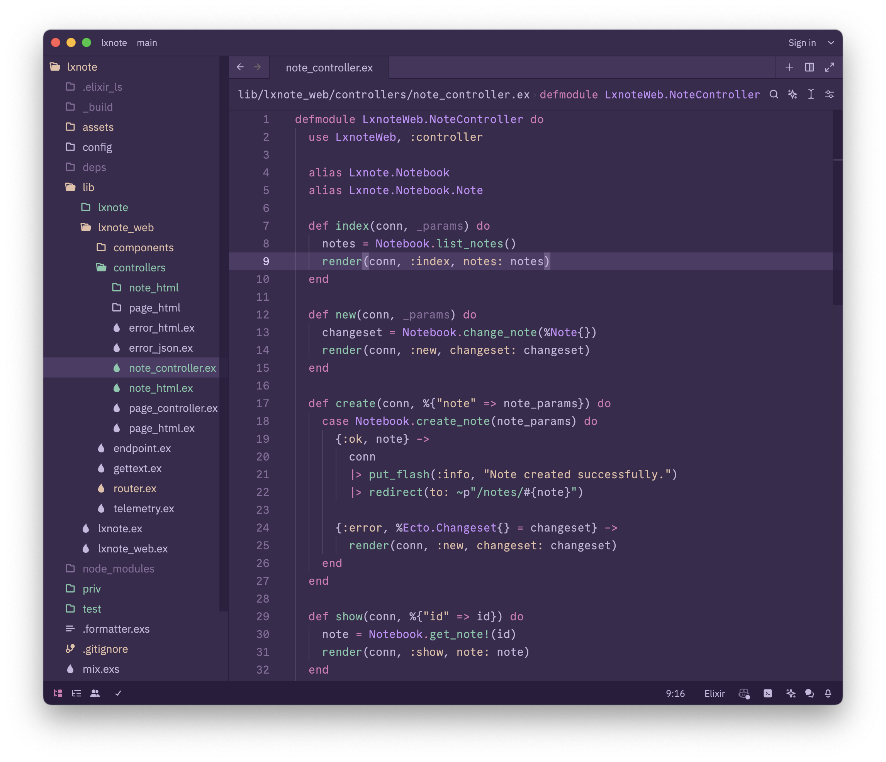

# BooBerry Theme for Zed

Based on Helix's [boo_berry](https://github.com/helix-editor/helix/blob/master/runtime/themes/boo_berry.toml) theme.

### Installation
1. Copy the `boo_berry.json` to `~/.config/zed/themes`.
2. Set `theme` to `BooBerry` in `~/.config/zed/settings.json`

### Screenshot

